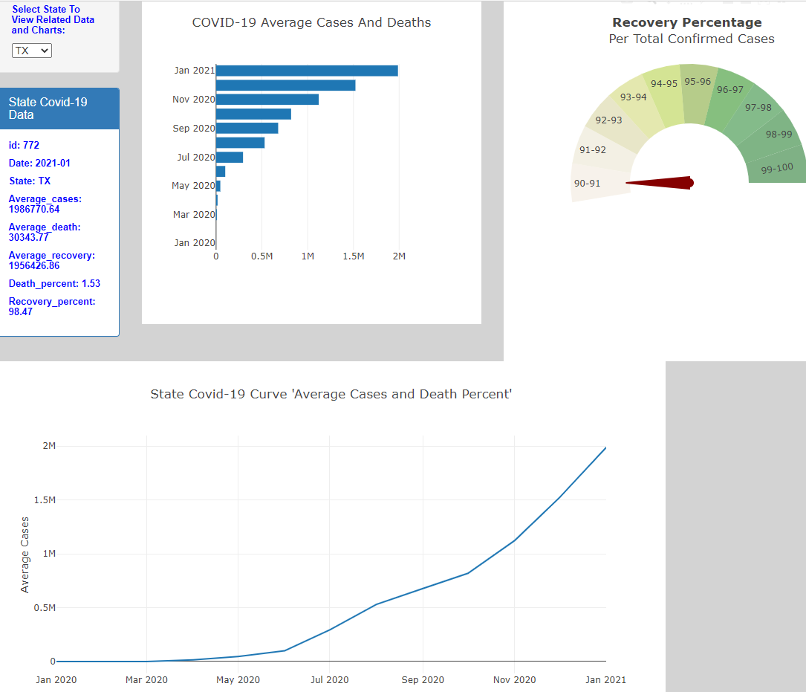

# Project COVID-19
-----------

Explore the data click [Dashboard](https://covid-19-infection-dashboard.herokuapp.com/) to view charts.
## Project Topic:
The topic of this project is COVID-19 pandemic using updated pandemic data from CDC, click 
[CDC](https://data.cdc.gov/Case-Surveillance/United-States-COVID-19-Cases-and-Deaths-by-State-o/9mfq-cb36) to view raw data.

## Introduction:
COVID-19 is a new virus and as such there is not enough data to do an in depth analysis. However as the virus continues 
to spread at an alarming rate throughout the United States and the world, we can study the collected infection data and
study any trands and patterns about the rate of infection and recovery and compare States to figure out who is doing well
and who is failing.

## Analysis
We build an interactive dashboard for all US States and territories. It shows monthly average number
of cases, averge death and death percentage, average recovery and recovery percentage. We built horizontal
bar chart to show average cases and death numbers. Line chart to show State curves with average cases
numbers and death percent and a gauge chart for recovery percent. All stats are average numbers per month
from start of pandemic till January 2021.

Our analysis shows that, the death rate is going down despite increased new cases of infection. This could be attributed 
to medical professionals getting used to the virus and may be developing new protocols on how to treat COVID-19 patients 
and the effectiveness of different medications and medical procedures currently in use.

